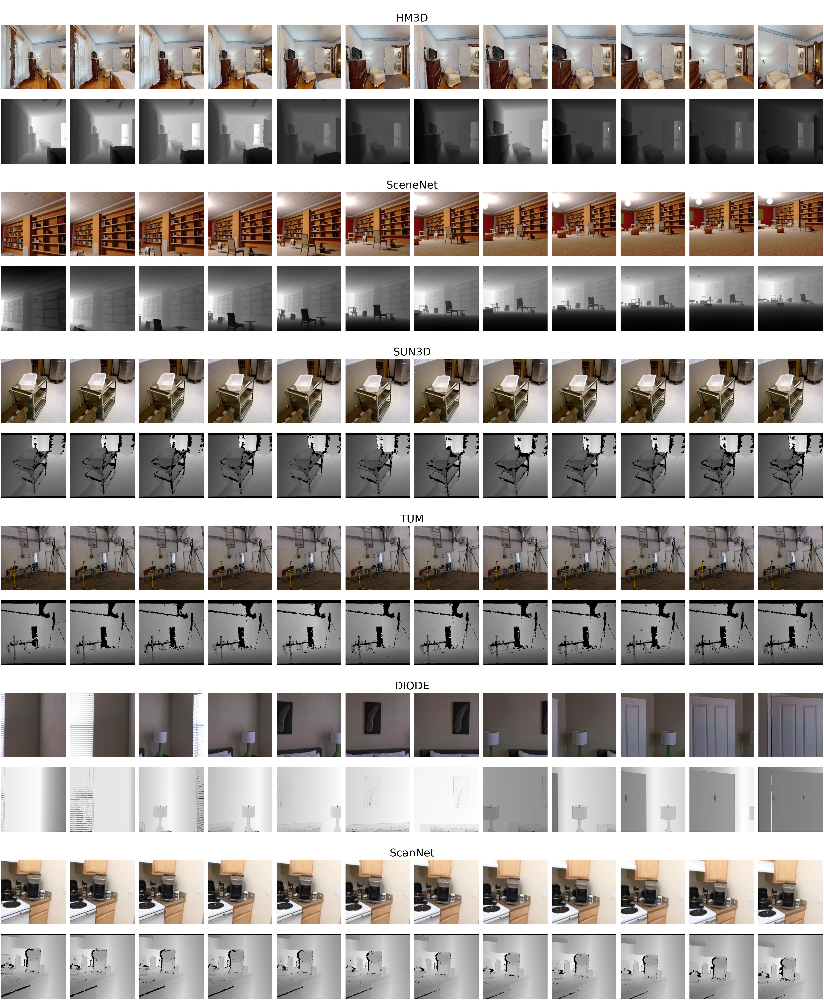
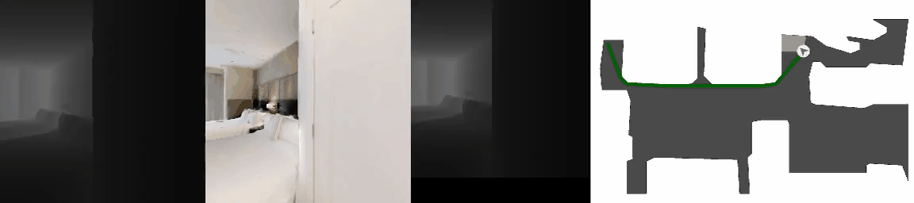
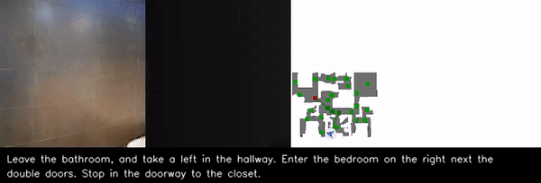
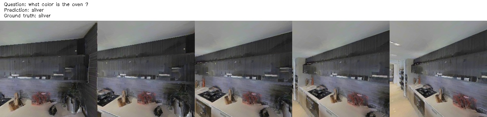
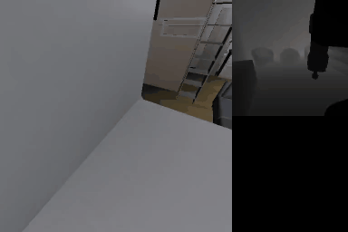

# TAC


## Setup environments
1. Use [anaconda](https://anaconda.org/) to create a Python 3.8 environment:
```bash
conda create -n py38 python3.8
conda activate py38
```
2. Install requirements
```base
pip install -r requirements
```

## UniRGBD dataset
An unified and universal RGB-D database for depth representation pre-training.


The script for unifying various RGB-D frames to generate UniRGBD is `scripts/rgbd_data.ipynb`. You can download our pre-processed version (split into several parts due to too large size): \[[HM3D](https://pan.baidu.com/s/1bUUJnB_dI3cEv2U3j04ufA)\]\[[SceneNet](https://pan.baidu.com/s/1YCJkQHWhGAUxGD9orNAcJw)\]\[[SUN3D](https://pan.baidu.com/s/1gtF_Ybsc758ntnIbK2LotA)\]\[[TUM, DIODE, NYUv2](https://pan.baidu.com/s/1idvJlEUzZDmTZSixTuxkEQ)\]\[[Evaluation data](https://pan.baidu.com/s/1_RtF_D-KApDEnIqCStqVZQ)\]. The access code is `tacp`.

**Important: HM3D is free for academic, non-commercial research, but requires the access from [Mattterport](https://matterport.com/habitat-matterport-3d-research-dataset). After getting the access and 3D scenes, you can run `scripts/hm3d_data.mp.py` to generate RGB-D frames or download the pre-processed version.**

After decompression, the folder structure will be like (there may exist a few redundant folders):
```
data/rgbd_data/
├── diode_clean_resize
│   └── train
│       ├── indoors
│       └── outdoor
├── hm3d_rgbd
│   └── train
│       ├── 0
│       ├── 1
│       └── ...
├── nyuv2_resize
│   ├── all
│   ├── train
│   └── val
├── pretrain_val
│   ├── diode_val
│   ├── hm3d_val
│   ├── nyuv2_val
│   ├── scenenet_val500
│   ├── sun3d_val
│   └── tum_val
├── scenenet_resize
│   └── train
│       ├── 0
│       ├── 1
│       └── ...
├── sun3d
│   ├── train
└── tumrgbd_clean_resize
    ├── train
```
Note that all path variables in scripts are absolute, so remember to change them as needed.
You can add arbitrary new data by appending the new folder to `_C.DATA.RGBD.data_path` in `config/default.py`.

Oringinal data source links: [HM3D](https://aihabitat.org/datasets/hm3d/), [SceneNet](https://robotvault.bitbucket.io/scenenet-rgbd.html), [SUN3D](https://sun3d.cs.princeton.edu/), [TUM](https://vision.in.tum.de/data/datasets/rgbd-dataset/download), [DIODE](https://diode-dataset.org/) and [NYUv2](http://horatio.cs.nyu.edu/mit/silberman/nyu_depth_v2/nyu_depth_v2_labeled.mat).

## Run pre-training
### train
`train.sh` is used for training on single GPU; `multi_proc.sh` is used for training on multiple GPUs. The pre-trained weights will be stored in `data/checkpoints`.
### evaluate
`eval.sh` supplies the standard evaluation procedure, including non-shuffle, block-shuffle, shuffle and out-domain.
Metrics calculation can be found in `trainers/dist_trainer.py`.
The evaluation results will be stored in `data/checkpoints/{}/evals`.
### check evaluation order
For fair comparison, we supply the standard evaluation order files [here](https://www.jianguoyun.com/p/DT6AsIMQhY--CRjZx40FIAA). 
Run `generate_eval_order.sh` to compare whether the evaluation orders are same as ours.
## Evaluation performance
|     | Shuffle Top-1 | Block-shuffle Near-1 | Non-shuffle Near-1 | Out-domain Top-1 |
|-----|:-------------:|:--------------------:|:------------------:|:----------------:|
| TAC |     0.974     |         0.642        |        0.603       |       0.942      |

## Pretrained weight

\[[Checkpoint](https://www.jianguoyun.com/p/DdTCEJwQhY--CRiuxY0F)\]

## Extended experiments
1. `scripts/uncertainty.ipynb`: Conduct the MC Dropout uncertainty analysis.
2. `scripts/zero_shot.ipynb`: Conduct zero-shot room classification by depth images.

## Embodied experiments
Experiment codes are stored in [here](https://github.com/RavenKiller/TACEmbodied).
### Visualization

PointNav



VLN



EQA



Rearrange


